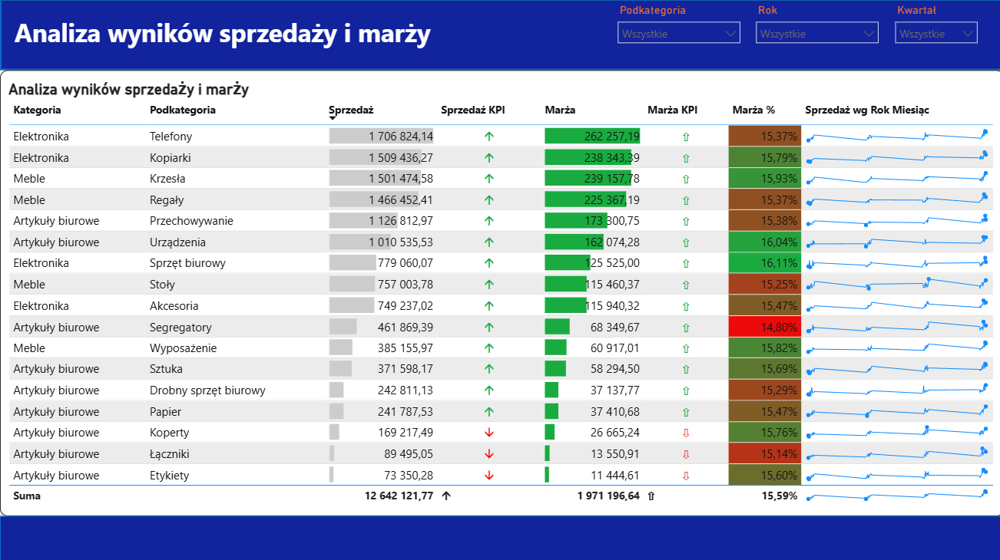
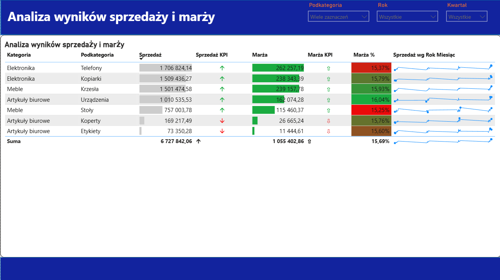

# Sales-Profitability-Dashboard
Interactive Power BI dashboard for sales and profit margin analysis with KPI tracking, trend analysis, and product performance insights.

# Analiza wyników sprzedaży i marży – Power BI

Projekt przedstawia interaktywny dashboard Power BI służący do analizy sprzedaży, marży oraz realizacji KPI na poziomie kategorii i podkategorii produktów.

## Cel projektu

Celem raportu jest umożliwienie szybkiej analizy wyników sprzedażowych oraz identyfikacja najlepiej i najsłabiej performujących grup produktowych.

Raport pozwala odpowiedzieć na pytania:

- które podkategorie generują najwyższą sprzedaż,
- które produkty osiągają najlepszą marżę,
- które obszary realizują założone KPI,
- jak zmieniała się sprzedaż w czasie,
- które podkategorie wymagają dodatkowej analizy.

## Technologie

- Power BI Desktop
- Power Query
- DAX
- Excel

## Zakres raportu

Dashboard zawiera:

- analizę sprzedaży według kategorii i podkategorii,
- analizę marży i marży procentowej,
- wskaźniki KPI sprzedaży i marży,
- formatowanie warunkowe,
- miniwykresy trendów sprzedaży,
- interaktywne filtry dla roku, kwartału i podkategorii.

## Główne KPI

- Sprzedaż
- Marża
- Marża %
- Sprzedaż KPI
- Marża KPI

## Funkcjonalności

- dynamiczne filtrowanie danych,
- formatowanie warunkowe,
- data bars,
- KPI icons,
- sparklines,
- analiza trendów sprzedażowych.

## Podgląd dashboardu

### Widok główny

### Widok z wybranymi podkategoriami

## Pliki w repozytorium

- `Sales & Profitability Dashboard.pbix` – plik raportu Power BI
- `Data/Data.xlsx` – dane źródłowe
- `screenshot/dashboard-sprzedaz-marza.png` – główny widok dashboardu
- `screenshot/dashboard-sprzedaz-marza-wybrane-podkategorie.png` – dashboard z zastosowanymi filtrami
- `README.md` – opis projektu

## Wnioski biznesowe

Raport pozwala szybko zauważyć, które podkategorie produktów odpowiadają za największą część sprzedaży oraz które generują najwyższą marżę. Dzięki zastosowaniu KPI i formatowania warunkowego użytkownik może łatwo zidentyfikować obszary wymagające poprawy.
